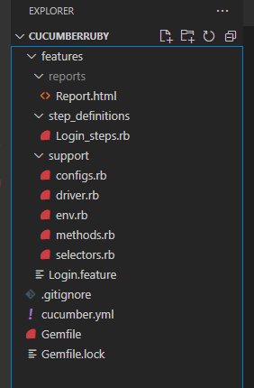

# CucumberRuby

This repo has the code which implements a Selenium Test framework using BDD (Cucumber.rb) and Ruby for the website, https://www.saucedemo.com/

Project setup guide is available in the PDF doc [CucumberRuby.pdf](CucumberRuby.pdf)

### **Folder Structure**

